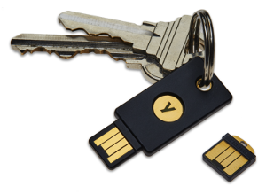

# Introduction

[Yubico](https://www.yubico.com) sells hardware [two-factor authentication](https://en.wikipedia.org/wiki/Multi-factor_authentication) devices called YubiKeys. Several of these, most recently the YubiKey 4, can also be used as [PGP](https://en.wikipedia.org/wiki/Pretty_Good_Privacy) [smartcards](https://en.wikipedia.org/wiki/OpenPGP_card).

{width=125px}

The purpose of this kind of smartcard is to provide physical control of security technology. In other words, these instructions setup a YubiKey for encryption, authentication, and signing.

For example, I personally use the [`pass`](https://www.passwordstore.org/) password manager. `pass` uses GPG to encrypt and decrypt my passwords.  Without the right key, you can't unlock the passwords. Typically, people store their keys on their various devices. If an adversary gets access to such a device, they need to guess or crack the key's password to use it.

With a smartcard, *another* layer is added: an adversary has to gain access to the physical device *and* the smartcard in order to even begin guessing the password. This means that the smartcard acts as a "master key". If someone broke into my home, stole my laptop, or otherwise got ahold of my `pass` database, they'd also have to get my GPG keys. Since those keys are physically _on my keyring_, my adversary would have to pick my pocket as well. Even then, my adversary would then have to be able to break the password on the YubiKey. While not bullet-proof, this is a pretty good system. If your adversary has the power to both take your personal property and your person, you may want to reconsider more than just this technique.

This setup can be used for decrypting and encrypting email, for signing code, and managing [SSH](https://en.wikipedia.org/wiki/Secure_Shell) access. Instead of having to add SSH keys for every machine you might use to access a [VPS](https://en.wikipedia.org/wiki/Virtual_private_server), you can take one SSH key with you.

Setting up an OpenPGP smartcard is an advanced security technique that offers developers, technicians, or those with a heightend threat model an additional layer of protection and a convenient way to manage access. While PGP is neither well-loved nor easy-to-use, it is effective for the aforementioned tasks. 
\newpage

# Instructions
## Generate a new GPG Key

    $ gpg --full-gen --expert

  * Key type: `ECC & ECC`
  * Algorithm: `Curve 25519`

## Create Subkeys

    $ gpg --expert --edit-key name@example.com

* Use `addkey` to make `RSA-4096` signing, encryption, and authorization subkeys.
* `> save`

## Export Keys

    $ gpg --output public-key.asc \
          --armor                 \
          --export name@example.com

    $ gpg --output secret-key.asc \
          --armor                 \
          --export-secret-keys name@example.com

## Loading the YubiKey

    $ gpg --edit-key name@example.com
      > toggle
      > key 2
      > keytocard
      > (s)ign
      > key 2
      > [... etc.]
      > save

## Removing Keys

    $ gpg --edit-key name@example.com
      > key 1pub
      > delkey
      > save

    $ gpg --delete-secret-keys

    $ gpg --import sub-keys.asc
